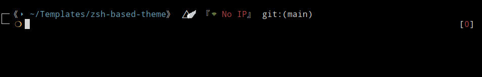

# Based ZSH Theme

A minimal and functional ZSH theme designed for developers and sysadmins who frequently work on remote servers, VPS, or VPNs. This theme prominently displays your current public IP when connected to a remote network, helping you stay aware of your connection status.

## Features

* ⚡ Clean and minimal prompt
* 🌐 Shows your current public IP when connected to a VPS, VPN, or remote server
* ✅ Compatible with most terminal emulators

## Preview




## Installation

### 1. Clone the repository or download on releases

```bash
git clone https://github.com/Rodr1goTavares/based-zsh-theme
```

### 2. Move the theme file to your ZSH themes folder

```bash
mv based-zsh-theme/based.zsh-theme ~/.oh-my-zsh/themes/
```

### 3. Apply the theme

Edit your `~/.zshrc` file and set:

```bash
ZSH_THEME="based"
```

### 4. Reload ZSH

```bash
source ~/.zshrc
```

## Public IP Display

The theme will automatically detect and display your current public IP address whenever you're connected to a VPS, VPN, or remote server.

## Requirements

* `curl` or `wget` installed (for fetching public IP)
* ZSH installed
* Oh My Zsh (or manual sourcing)

## Optional: Manual IP Check Script

If you want to manually check your public IP, you can use:

```bash
curl ifconfig.me
```

Or

```bash
wget -qO- ifconfig.me
```

## License

MIT License

## Contributions

Pull requests and suggestions are welcome! Feel free to fork and improve.

---

Made by [Your Name](https://github.com/yourusername)

